

<a href="https://github.com/juanplazadev"></a><a href="https://www.linkedin.com/in/juan-plaza-59a6a9296"></a><a href="https://juanplaza.dev"></a><a href="mailto:juan@juanplaza.dev"></a>
<a href="https://github.com/juanplazadev/check-in-v2"></a><a href="https://github.com/juanplazadev/juanplazadev"></a>
<a href="https://github.com/juanplazadev/phinx/tree/feature/db2-adapter"></a><a href="https://github.com/juanplazadev/discord-show-reminder"></a>

